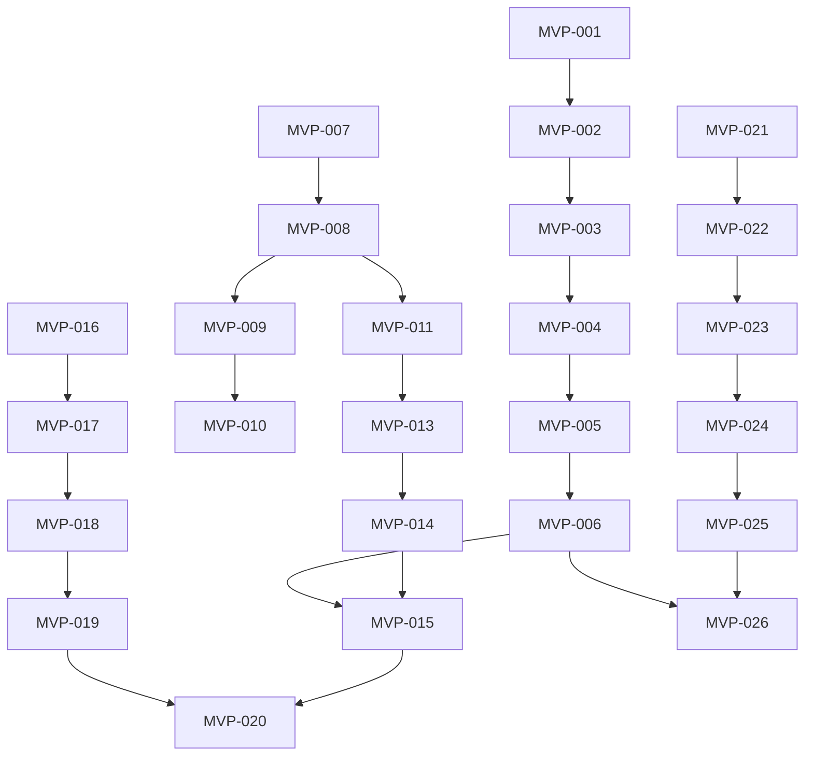

# Bridge Kit Tasks

## Task Legend

- **Priority**: P0 (blocker), P1 (critical), P2 (important), P3 (nice-to-have)
- **Status**: 🔴 Not Started, 🟡 In Progress, 🟢 Complete, ⏸️ Blocked
- **Effort**: XS (<1h), S (1-2h), M (2-4h), L (4-8h), XL (>8h)

---

## Phase 1: MVP (Days 1-2)

### Epic: Infrastructure Setup

| ID | Task | Priority | Effort | Status | Owner | Notes |
|----|------|----------|--------|--------|-------|-------|
| MVP-001 | Install Docker and Docker Compose | P0 | XS | 🔴 | - | Required for n8n |
| MVP-002 | Start n8n container locally | P0 | S | 🔴 | - | `docker run -p 5678:5678 n8nio/n8n` |
| MVP-003 | Create n8n admin account | P0 | XS | 🔴 | - | First login setup |
| MVP-004 | Import context-router workflow | P0 | S | 🔴 | - | Use provided JSON |
| MVP-005 | Activate webhook trigger | P0 | XS | 🔴 | - | Note full URL |
| MVP-006 | Test webhook with curl | P0 | S | 🔴 | - | Verify 200 response |

### Epic: Chrome Extension

| ID | Task | Priority | Effort | Status | Owner | Notes |
|----|------|----------|--------|--------|-------|-------|
| MVP-007 | Create extension directory structure | P0 | XS | 🔴 | - | `chrome-extension/` |
| MVP-008 | Write manifest.json | P0 | S | 🔴 | - | MV3 format |
| MVP-009 | Write service-worker.js | P0 | M | 🔴 | - | Context menu + dispatch |
| MVP-010 | Write content.js | P1 | S | 🔴 | - | DOM extraction |
| MVP-011 | Write popup.html/js | P1 | M | 🔴 | - | Config UI |
| MVP-012 | Generate placeholder icons | P2 | XS | 🔴 | - | 16/48/128 PNG |
| MVP-013 | Load extension in Chrome | P0 | XS | 🔴 | - | Developer mode |
| MVP-014 | Configure webhook URL | P0 | XS | 🔴 | - | Via popup |
| MVP-015 | Test context capture | P0 | S | 🔴 | - | Select text → right-click |

### Epic: GitHub Integration

| ID | Task | Priority | Effort | Status | Owner | Notes |
|----|------|----------|--------|--------|-------|-------|
| MVP-016 | Create GitHub App OR generate PAT | P0 | M | 🔴 | - | GitHub App preferred |
| MVP-017 | Add GitHub credential to n8n | P0 | S | 🔴 | - | Settings → Credentials |
| MVP-018 | Connect GitHub node in workflow | P0 | S | 🔴 | - | Issue creation |
| MVP-019 | Test issue creation via curl | P0 | S | 🔴 | - | Full flow |
| MVP-020 | Test issue creation via extension | P0 | S | 🔴 | - | Browser → GitHub |

### Epic: MCP Server

| ID | Task | Priority | Effort | Status | Owner | Notes |
|----|------|----------|--------|--------|-------|-------|
| MVP-021 | Initialize MCP server project | P1 | S | 🔴 | - | `npm init` |
| MVP-022 | Install MCP SDK | P1 | XS | 🔴 | - | `@modelcontextprotocol/sdk` |
| MVP-023 | Write index.ts | P1 | L | 🔴 | - | Tool definitions |
| MVP-024 | Build TypeScript | P1 | XS | 🔴 | - | `npm run build` |
| MVP-025 | Configure Claude Desktop | P1 | S | 🔴 | - | Edit config JSON |
| MVP-026 | Test MCP tools | P1 | M | 🔴 | - | Ask Claude to use tool |

---

## Phase 2: Production Hardening

### Week 1: Infrastructure

| ID | Task | Priority | Effort | Status | Owner | Notes |
|----|------|----------|--------|--------|-------|-------|
| PROD-001 | Provision production server | P0 | M | 🔴 | - | DigitalOcean/AWS/GCP |
| PROD-002 | Install Docker on server | P0 | S | 🔴 | - | + Docker Compose |
| PROD-003 | Create docker-compose.yml | P0 | M | 🔴 | - | n8n + PostgreSQL |
| PROD-004 | Configure environment variables | P0 | S | 🔴 | - | .env file (not in git) |
| PROD-005 | Deploy n8n with PostgreSQL | P0 | M | 🔴 | - | `docker-compose up -d` |
| PROD-006 | Configure DNS | P0 | S | 🔴 | - | A record for subdomain |
| PROD-007 | Install Nginx reverse proxy | P0 | M | 🔴 | - | + SSL termination |
| PROD-008 | Get Let's Encrypt certificate | P0 | S | 🔴 | - | Certbot |
| PROD-009 | Import workflow to production | P0 | S | 🔴 | - | Same JSON |
| PROD-010 | Add production credentials | P0 | M | 🔴 | - | Google, GitHub, Slack |
| PROD-011 | Implement HMAC validation | P0 | M | 🔴 | - | Code node in workflow |
| PROD-012 | Generate HMAC secret | P0 | XS | 🔴 | - | `openssl rand -hex 32` |
| PROD-013 | Update extension with secret | P0 | S | 🔴 | - | Popup config |
| PROD-014 | Test HMAC validation | P0 | S | 🔴 | - | Unsigned = rejected |

### Week 2: Chrome Extension

| ID | Task | Priority | Effort | Status | Owner | Notes |
|----|------|----------|--------|--------|-------|-------|
| PROD-015 | Design side panel UI | P1 | M | 🔴 | - | Wireframe/mockup |
| PROD-016 | Implement sidepanel.html | P1 | L | 🔴 | - | Full UI |
| PROD-017 | Implement sidepanel.js | P1 | L | 🔴 | - | Action history, config |
| PROD-018 | Add Google OAuth to manifest | P1 | S | 🔴 | - | oauth2 section |
| PROD-019 | Implement chrome.identity flow | P1 | L | 🔴 | - | getAuthToken() |
| PROD-020 | Implement Drive file picker | P2 | L | 🔴 | - | Google Picker API |
| PROD-021 | Create IndexedDB schema | P1 | M | 🔴 | - | Offline queue |
| PROD-022 | Implement queue storage | P1 | L | 🔴 | - | Add to queue on failure |
| PROD-023 | Implement queue sync | P1 | L | 🔴 | - | Sync on navigator.onLine |
| PROD-024 | Add queue status to popup | P1 | M | 🔴 | - | "X items queued" |
| PROD-025 | Write extension tests | P2 | L | 🔴 | - | Jest + puppeteer |

### Week 3: MCP + Features

| ID | Task | Priority | Effort | Status | Owner | Notes |
|----|------|----------|--------|--------|-------|-------|
| PROD-026 | Add Google Docs credentials to n8n | P1 | S | 🔴 | - | OAuth |
| PROD-027 | Add Google Sheets credentials | P1 | S | 🔴 | - | OAuth |
| PROD-028 | Add Slack Bot credentials | P1 | S | 🔴 | - | Bot token |
| PROD-029 | Implement docs_append workflow | P1 | M | 🔴 | - | n8n Google Docs node |
| PROD-030 | Implement sheets_append workflow | P1 | M | 🔴 | - | n8n Google Sheets node |
| PROD-031 | Implement slack_send workflow | P1 | M | 🔴 | - | n8n Slack node |
| PROD-032 | Add docs_append MCP tool | P1 | S | 🔴 | - | Update index.ts |
| PROD-033 | Add sheets_append MCP tool | P1 | S | 🔴 | - | Update index.ts |
| PROD-034 | Add slack_send MCP tool | P1 | S | 🔴 | - | Update index.ts |
| PROD-035 | Test all MCP tools end-to-end | P1 | L | 🔴 | - | Full flow tests |

### Week 4: Observability + Security

| ID | Task | Priority | Effort | Status | Owner | Notes |
|----|------|----------|--------|--------|-------|-------|
| PROD-036 | Add correlation ID to all nodes | P1 | M | 🔴 | - | $json.correlationId |
| PROD-037 | Configure n8n execution logging | P1 | S | 🔴 | - | Structured JSON |
| PROD-038 | Create error workflow | P1 | L | 🔴 | - | Catch errors → Slack |
| PROD-039 | Connect error workflow | P1 | S | 🔴 | - | Settings → Error Workflow |
| PROD-040 | Set up Redis for rate limiting | P2 | M | 🔴 | - | Docker container |
| PROD-041 | Implement rate limit check | P2 | L | 🔴 | - | Code node |
| PROD-042 | Document token rotation procedure | P1 | M | 🔴 | - | Runbook |
| PROD-043 | Security audit: HMAC | P0 | M | 🔴 | - | Verify all endpoints |
| PROD-044 | Security audit: Allowlists | P0 | M | 🔴 | - | Verify action filtering |
| PROD-045 | Security audit: Credentials | P0 | M | 🔴 | - | No secrets in code |
| PROD-046 | Write load test script | P2 | L | 🔴 | - | hey or k6 |
| PROD-047 | Run load tests | P2 | M | 🔴 | - | 100 req/min baseline |
| PROD-048 | Document performance baselines | P2 | S | 🔴 | - | p50, p99 latencies |

---

## Ongoing Tasks

| ID | Task | Priority | Frequency | Status | Owner | Notes |
|----|------|----------|-----------|--------|-------|-------|
| OPS-001 | Run smoke tests | P0 | Daily | 🔴 | - | smoke-test.sh |
| OPS-002 | Check n8n error workflow | P0 | Daily | 🔴 | - | Slack channel |
| OPS-003 | Review n8n execution history | P1 | Weekly | 🔴 | - | Look for patterns |
| OPS-004 | Update dependencies | P2 | Monthly | 🔴 | - | npm audit |
| OPS-005 | Rotate GitHub App key | P1 | Yearly | 🔴 | - | Or on compromise |
| OPS-006 | Rotate HMAC secret | P2 | Quarterly | 🔴 | - | Update all clients |
| OPS-007 | Backup PostgreSQL | P0 | Daily | 🔴 | - | pg_dump |
| OPS-008 | Test restore procedure | P1 | Monthly | 🔴 | - | Verify backups work |

---

## Backlog (Future)

| ID | Task | Priority | Effort | Notes |
|----|------|----------|--------|-------|
| FUT-001 | Publish extension to Chrome Web Store | P2 | L | Requires developer account |
| FUT-002 | Add semantic search (Vertex AI) | P3 | XL | Vector embeddings |
| FUT-003 | Add voice capture | P3 | XL | MediaRecorder → Whisper |
| FUT-004 | Multi-tenant support | P3 | XL | Per-org credentials |
| FUT-005 | GitLab/Bitbucket support | P3 | L | Alternative Git providers |
| FUT-006 | Publish MCP server to npm | P2 | M | Public package |
| FUT-007 | Create n8n community node | P3 | XL | Installable node |

---

## Dependencies

---

## Completion Criteria

### MVP Done When:
- [ ] All MVP-* tasks complete
- [ ] Smoke tests pass
- [ ] Demo: Browser → GitHub issue in < 5s
- [ ] Demo: MCP tool creates issue

### Production Done When:
- [ ] All PROD-* tasks complete
- [ ] Integration tests pass
- [ ] Performance baselines documented
- [ ] Security audit passed
- [ ] Error alerting verified
- [ ] Runbook complete
